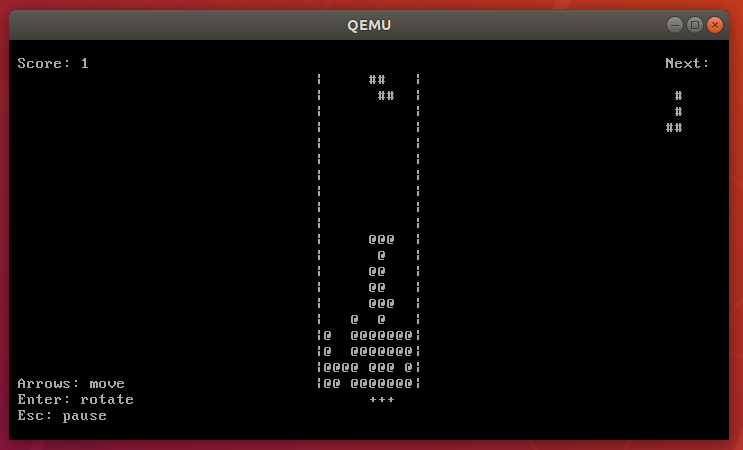
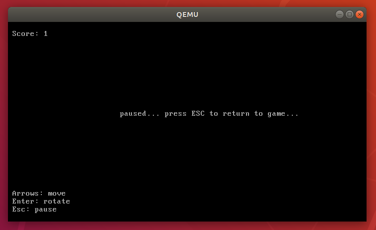

### Description
This is my 5th term coursework on the "Operating Systems" subject at the [Department of Computer Science and Technologies](https://github.com/bmstu-iu9), [Bauman Moscow State Technical University](http://www.bmstu.ru/).<br>
The main aim is to get acquainted with principle of OS kernel operation at low level.
As a sequence, develop minimal C libraries for I/O tasks (e.g., functions like putchat, printf, gets, scanf) and memory management (malloc, free, and so on).
Finally, write an app demonstrating their efficiency.
### How it actually works
Project building with [Make](https://www.gnu.org/software/make/) tool. [Makefile](https://github.com/nexterot/develop-os-free/blob/master/Makefile) contains all the logic. Here are main steps:
1. Kernel compilation from C source (32 bit);
2. Disk image creation and partitioning (using ext2 filesystem);
3. Installing grub into image via grub-install tool;
4. Embedding kernel into image.
### What is done by far
- A minimal OS kernel supporting [Multiboot](https://www.gnu.org/software/grub/manual/multiboot/multiboot.html) specification;
- Embedding [grub2](https://www.gnu.org/software/grub/) bootloader;
- Input functions: getchar, gets;
- Output functions: putchar, puts; also printf function taken from other source;
- Cursor functions: disable_cursor, enable_cursor, move_cursor, update_cursor;
- Time functions: delay, sleeps;
- Memory functions: malloc, free;
- Random functions: rand, srand, rtc_seed;
- Example application: the Tetris game.
### How to test it without compiling kernel
Get image file (disk.img) from latest [release](https://github.com/nexterot/develop-os-free/releases), then just write it to a USB or run with x86 emulator. For [QEMU](https://www.qemu.org/) it is the following command:
```bash
spam@eggs:~$ sudo qemu-system-i386 -hda disk.img
```
### How to compile kernel
<details><summary>Guide</summary>
  
<p>

#### Dependencies
- make
- gcc
- as
- ld
- grub2
- qemu
#### Supported hosts
**Linux**. Currently developing and testing on Ubuntu 18.04 LTS minimal.
#### 
First make sure you have all tools listed in **Dependencies** block installed. Then do the following:
```bash
spam@eggs:~$ git clone https://github.com/nexterot/develop-os-free
spam@eggs:~$ cd develop-os-free
spam@eggs:~$ make
```
In case of errors, or just to clean the directory:
```bash
spam@eggs:~$ make clean
```
Also, the following command is an alias for ```make clean && make```:
```bash
spam@eggs:~$ make rebuild
```
#### Test with emulator
To test it with QEMU emulator, run:
```bash
spam@eggs:~$ make run
```

#### If you ran into some problem  
#### Problem:
```
losetup: bin/disk.img: failed to set up loop device: Device or resource busy
```
#### Solution:<br>
Find busy loop devices:
```bash
spam@eggs:~$ losetup -a
```
Then edit next lines in Makefile, changing '/dev/loop2' or\and '/dev/loop3' to any free loop device:
```
loop_first  = /dev/loop2
loop_second = /dev/loop3
```
Finally do:
```bash
spam@eggs:~$ make rebuild
```

</p>
</details>

### Screenshots


